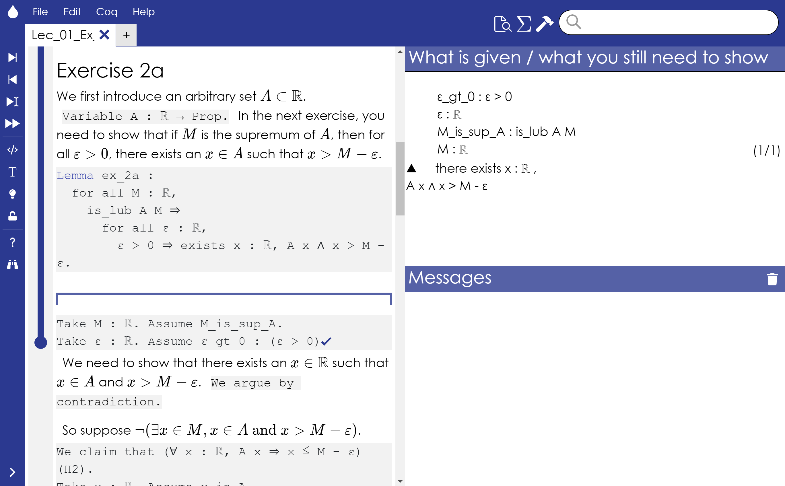

# Waterproof

Waterproof is an educational tool in which students can interactively prove mathematical statements. Here is an example of an exercise and part of its solution in Waterproof.



## How to get started

To get started with Waterproof, the following steps are necessary:

* Install SerAPI
* Install Node.js
* Clone the repository
* Build the app

We now describe these steps in detail.

### Installation of SerAPI

Waterproof communicates with the interactive theorem prover CoQ through the SerAPI library.

The following steps describe how to install SerAPI.

#### Installation of SerAPI on Windows

##### Install OCaml for Windows 

Install OCaml for Windows from https://fdopen.github.io/opam-repository-mingw/installation/

##### Install opam

OCaml for Windows installs a cygwin terminal. In the terminal, execute the following commands (corresponding to instructions on https://ocaml.org/docs/install.html).

First initialize the environment with
```
opam init
eval `opam env`
```

Then install OCaml with
```
opam switch create 4.07.1+mingw64c 
eval `opam env`
```
To see if you installed the correct version, execute
```
which ocaml
ocaml -version
```

#### Install SerAPI with opam

```
opam install coq-serapi
```

### Clone this repository

### Point Waterproof to the location of sertop

Change the `sertopPath` variable in the `wrapper/configuration/wpconfig.json` file to the location where the `sertop` executable was installed.

### Install Node.js

Install Node.js, for instance from [Node.js](https://nodejs.org/en/download/)

### Install the necessary modules

In a terminal, move to the Waterproof base directory. Then, to install the necessary Node.js modules, run:
```
npm install
```

### Build the electron app

To build the Electron app run:
```
npm run build-release
```

Finally, to start the application run:
```
npm start
```

## Waterproof notebooks and libraries

The repository now includes special Coq libraries. They focus on:

* *Tactics* that provide syntax closer to ordinary mathematics
* *Lemmas* that help in proving statements in Analysis

Currently, the library files (with extension `.vo`) are in the .gitignore, because they are likely to be platform-dependent. To use them, you will need to compile them yourself. 
They should be compiled, from the *wrapper* directory, to a library called wplib as follows:

```
sercomp -R "wplib","wplib" --mode=vo ".\wplib\Tactics\Tactics.v"
```

where `sercomp` should be replaced by the absolute sercomp path.

To import the libraries, it is important to add the correct directory to the loadpath. For instance, 
most of the notebooks are saved in the Notebooks folder. On Windows, if you double click on the filename in this folder, the working directory of WaterProof is automatically the Notebooks folder. To add the correct loadpath, you then need to add

```
Add LoadPath "..\..\".
```

at the beginning of the file. Next, the library can be imported with

```
Require Import wplib.Tactics.Tactics.
```

To see the current working directory of WaterProof, you can always use the command 

```
Pwd.
```

## Project structure
* `/app`:
This folder is for all static assets, i.e. files that don't need any pre-processing before being used by Electron.

* `/e2e`:
This folder contains the project's end-to-end (integration) tests.

* `/src`:
This folder is for files that need to be transpiled or compiled before they can be used by Electron.

* `/test`:
This folder contains the project's unit tests.

After being transpiled and/or compiled by the build process, the resulting files will be placed in the `/app` folder.
This way, the `/app` folder will contain the full application after building.
